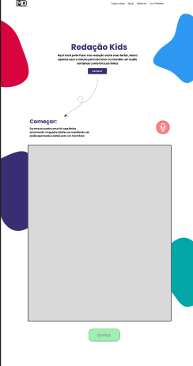

# **PROJETO: MINHAS FÉRIAS**

Integrante 1 - 2022.1 : Henry Murillo Lampoglio De Andrade | RGM: 29102936

Integrante 2 - 2022.2 : Erick Willian Soares Afonso | RGM: 31209521

Empresa: FishTechnology

Lider da Empresa: Lambarildo Peixe

## Dados do Cliente (Escola)

- **Nome da Escola** : Colégio Mello Dante
- **Contato Direto** : 
    - Tel: (11) 4699-2400 ou (11) 4699-1111
    - E-mail: secretaria@colegiomellodante.com.br
    - Site: https://colegiomellodante.com.br
- **Segmento** : Privada
- **Descrição** : 
    - O Colégio Mello Dante apresenta uma proposta pedagógica que prioriza a aprendizagem com foco na interação e nos ideais de solidariedade humana, tendo como finalidade o pleno desenvolvimento do educando e seu preparo para a vivência em sociedade.
    - Com mais de 20 mil metros quadrados, a estrutura do Colégio Mello Dante é planejada para o crescimento acolhedor de nossos alunos, privilegiando o desenvolvimento pedagógico, a integração social e a prática esportiva.
    - Eles possuem sala de informática com computadores e tablets , para 35 alunos por sala, e em cada sala há sempre pelo menos um deficiente visual.
    - **Localidade** : Av. Francisco Rodrigues Filho, 2075 - Vila Mogilar, Mogi das Cruzes - SP, 08773-380
    - Esse colégio tem Educação Infantil, Ensino Fundamental I,Ensino Fundamental II ,Ensino Médio
- **Publico Alvo**: Crianças do Ensino fundamental I , de 10 a 11 anos
- **Escopo do projeto**:
    - O site será feito em uma única página que nela ira conter um espaço para que a criança escreva seu texto usando o mouse (Para isso será usado a tag html canva), e uma área para que ela possa contar através de um audio como foi suas ferias
- **Regras de negócio**: 
    - Teremos que fazer o site de forma que fique responsivo para qualquer plataforma (Computador,tablet,celuar)
    - Fazer com que as crianças **escrevam** com o mouse (no caso de computadores), com caneta ou com o dedo (no caso de celulares e tablets)  
- **Acessibilidade** :
    - Terá um espaço para que elá consiga mandar um áudio contando como fo suas férias

 

## **Documentação de cores**

 

| Cor               | Hexadecimal                                                |
| ----------------- | ---------------------------------------------------------------- |
| Cor Blob      |
#D9043D
|
| Cor dos titulos       | 
 #382F73
  |
| Cor Blob       |
#2E97F2
 |
| Cor Blob       | 
#03A6A6
|
| Cor Botão Enviar      | 
#9EEFB0 
|

 

## **Protótipo**
- [Link do projeto no Figma](https://www.figma.com/file/IVvamm0gLFct9G2DUKlKim/Redação-Kids?node-id=0%3A1)

### ***Desktop:***

## Links uteis

- [Capturando Microfone no Navegador](https://www.youtube.com/watch?v=80giIJkO5V8)

- [Convertendo canvas em JPG](https://www.youtube.com/watch?v=YoVJWZrS2WU)
    
